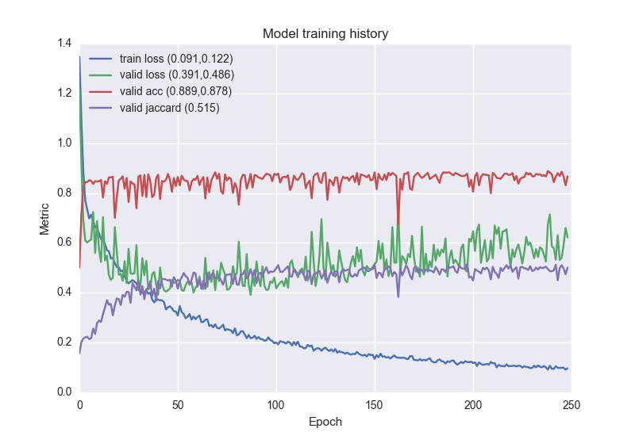
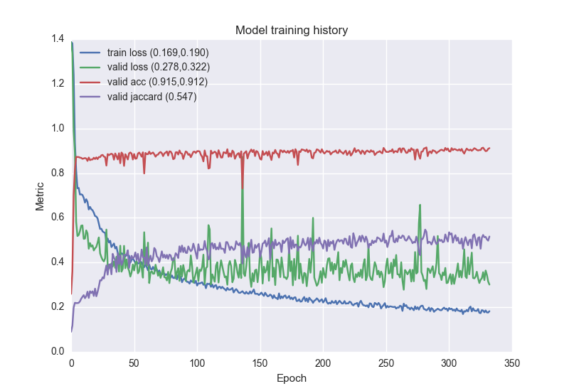
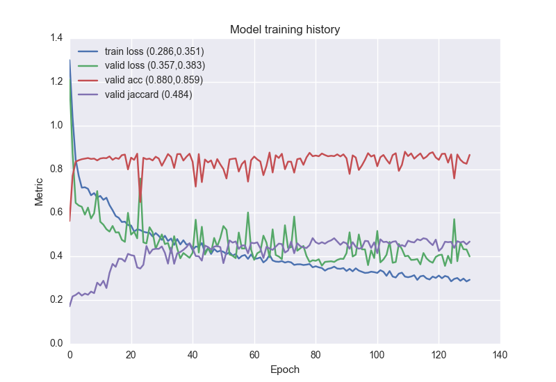

# Deep learning for polyp characterization

## Results Keras
| Id | Model | Parameters                         | Train set        | Val set          | Test set                       |Tr. Loss|Val. Loss|Val. Acc|Val. Jacc|Test Acc|Test Jacc|Epochs | Jaccard per class (Bckg, pol, Spec, Lum)|
| --- | --- | --- | --- | --- | --- | --- | --- | --- | --- | --- | --- | --- | --- |
| 0 | Jorge |                                     |                  |                  | CVC-912 (Ts)                    |        |         | 81.87% | 44.77%  | 75.58% | 41.19%  |       | [ 0.73937106  0.22136171  0.44868447  0.23820789] |
| 1 | FCN8 | Deconv, lr=1e-4, l2=0, No Data Augm, Crop    | CVC-912 (Tr)          | CVC-912 (Val)          | CVC-912 (Ts)       | 0.122  | 0.486    | 87.80% | 51.50%  | 89.90% | 48.35%  | 249  | [0.89426552,  0.38210112,  0.30895791,  0.34876279] |
| 2 | FCN8 | Deconv, lr=1e-4, l2=0, Data Augm (Flip, Rot(180), Zoom(0.1), Crop)  | CVC-912 (Tr)          | CVC-912 (Val)          | CVC-912 (Ts) | 0.190  | 0.322    | 91.20% | 54.70%  | 82.43% | 42.03%  | 333  | [0.81224501,  0.27955095,  0.26045998,  0.32914331] |
| 2 | FCN8 | Deconv, lr=1e-4, l2=1e-3, Data Augm (Flip, Rot(180), Zoom(0.1), Crop)  | CVC-912 (Tr)        | CVC-912 (Val)          | CVC-912 (Ts) | 0.456  | 0.383    | 86.19% | 47.94%  | 86.38% | 40.56%  | 230  | [0.85935511,  0.277499305, 0.25355784, 0.232259597 ] |
| 3 | FCN8 | Deconv, lr=1e-4, l2=0, Data Augm (Flip, Rot(180), Zoom(0.1), Elast0.1 Bil, Crop)     | CVC-912 (Tr)          | CVC-912 (Val)          | CVC-912 (Ts) | 0.351  | 0.383    | 85.90% | 48.40%  | 87.29% | 42.79%  | 130  | [0.86779401,  0.32364056,  0.28232848,  0.23794606] |
| 4 | FCN8 | Deconv, lr=1e-4, l2=0, Data Augm (Flip, Rot(180), Zoom(0.1), Elast0.1 NN, Crop)  | CVC-912 (Tr)          | CVC-912 (Val)          | CVC-912 (Ts) | 0.229  | 0.341    | 88.74% | 51.10%  | 89.82% | 48.33%  | 256  | [0.89206086,  0.47399949,  0.24423865,  0.32314031] |
| 5 | FCN8 | Deconv, lr=1e-4, l2=0, Data Augm (Flip, Rot(180), Zoom(0.1), Shear0.5, Crop)  | CVC-912 (Tr)      | CVC-912 (Val)          | CVC-912 (Ts) | 0.152  | 0.204    | 94.00% | 62.39%  | 89.69% | 55.13%  | ???  | [0.88818576,  0.51609229,  0.38878289,  0.41218452] |
| 6 | resunet | lr=1e-4, l2=1e-4, Data Augm (Flip, Rot(180), Zoom(0.1), Crop??)  | CVC-912 (Tr)      | CVC-912 (Val)          | CVC-912 (Ts) | 0.276  | 0.277    | 91.24% | 52.87%  | 85.32% | 48.41%  | 243  | [0.8424,  0.2683,  0.4269,  0.3988] |
| 7 | fcn8 | lr=1e-4, l2=0, Data Augm (Elast, Shear(.41), Rot(180), Warp(10, 3), Crop)  | CVC-912 (Tr)      | CVC-912 (Val)          | CVC-912 (Ts) | 0.199  |  0.204   | 93.18% | 59.75% |  87.52% |50.15 %| 140  | [0.866525760217, 0.416273424807, 0.365415822596, 0.357791154721] |
| 8 | fcn8 | lr=1e-4, l2=0, Data Augm (Elast 0.1 NN_NN, Crop)  | CVC-912 (Tr)      | CVC-912 (Val)          | CVC-912 (Ts) | 0.236  |  0.428   | 87.99% | 49.46% |  88.51% |43.59 %| 135  | [0.880836956436, 0.277972459212, 0.280322247846, 0.30453909272] |
| 9 | fcn8 | lr=1e-4, l2=0, Data Augm (Flip, Rot(180), Crop)  | CVC-912 (Tr)      | CVC-912 (Val)          | CVC-912 (Ts) | 0.267  |  0.340   | 87.42% | 50.68% |  87.66% |44.44 %| 226  | [0.87059292,  0.36487132,  0.26324498,  0.27922294] |
| 10 | fcn8 | lr=1e-4, l2=0, Data Augm (Zoom(0.1), Crop)  | CVC-912 (Tr)      | CVC-912 (Val)          | CVC-912 (Ts) | 0.098  |  0.371   | 90.72% | 57.72% |  90.40% |50.41 %| 234  | [0.89959234,  0.40648192,  0.33234649,  0.37825429] |
| 11 | fcn8 | lr=1e-4, l2=0, Data Augm (Shear(0.5), Crop)  | CVC-912 (Tr)      | CVC-912 (Val)          | CVC-912 (Ts) | 0.112  |  0.333   | 90.48% | 56.83% |  90.28% |51.70 %| 251  | [0.897379764481, 0.463613590256, 0.338904191903, 0.368358490143] |
| 12 | FCN8 | Deconv, lr=1e-4, l2=0, No Data Augm, Crop, RGBNorm | CVC-912 (Tr)  | CVC-912 (Val)          | CVC-912 (Ts)  | 0.097  | 0.277    | 92.70% | 57.52%  | 87.57% | 48.70%  | 241  | [0.8674, 0.31240, 0.31246, 45.5598] |
| 13 | FCN8 | Deconv, lr=1e-4, l2=0, Data Augm(Rot(15), Crop) | CVC-912 (Tr)  | CVC-912 (Val)          | CVC-912 (Ts)  | 0.115  | 0.502    | 87.39% | 49.66%  | 86.41% | 43.49%  | 252  | [0.858, 0.339, 0.294, 0.247] |
| 14 | FCN8 | Deconv, lr=1e-4, l2=0, Data Augm(Rot(45), Crop) | CVC-912 (Tr)  | CVC-912 (Val)          | CVC-912 (Ts)  | 0.105  | 0.354    | 90.91% | 56.81%  | 91.84% | 55.26%  | 285  | [0.913, 0.512, 0.351, 0.432] |
| 15 | FCN8 | Deconv, lr=1e-4, l2=0, Data Augm(Rot(180), Crop) | CVC-912 (Tr)  | CVC-912 (Val)          | CVC-912 (Ts)  | 0.163  | 0.263    | 91.38% | 58.88%  | 92.78% | 55.33%  | 301  | [0.923, 0.598, 0.270, 0.421] |
| 16 | FCN8 | Deconv, lr=1e-4, l2=0, Data Augm(Shear(0.4), Crop) | CVC-912 (Tr)  | CVC-912 (Val)       | CVC-912 (Ts)  | 0.087  | 0.253    | 92.58% | 59.89%  | 88.79% | 52.95%  | 256  | [0.878, 0.426, 0.358, 0.454] |
| 17 | FCN8 | Deconv, lr=1e-4, l2=0, Data Augm(Elast(10), Crop) | CVC-912 (Tr)  | CVC-912 (Val)       | CVC-912 (Ts)  | 0.114  | 0.322    | 90.93% | 58.97%  | 90.58% | 52.02%  | 182  | [0.900, 0.496, 0.347, 0.336] |
| 18 | FCN8 | Deconv, lr=1e-4, l2=0, Data Augm(Zoom(0.2), Crop) | CVC-912 (Tr)  | CVC-912 (Val)       | CVC-912 (Ts)  | 0.248  | 0.426    | 86.44% | 48.38%  | 85.45% | 42.32%  | 230  | [0.848, 0.271, 0.315, 0.257] |
| 19 | FCN8 | Deconv, lr=1e-4, l2=0, no Data Augm(Crop 288x385) | CVC-912 (Tr)  | CVC-912 (Val)       | CVC-912 (Ts)  | 0.174  | 0.391    | 89.50% | 53.06%  | 89.78% | 49.60%  | 101  | [0.893, 0.364, 0.340, 0.385] |

## Code to modify/ Experiments to do
- [ ] Add checkpoint to save best model according to Jaccard per polyp class
- [ ] Save both models (best Jaccard in polyps, best mean Jaccard)
- [ ] Consider class 2 (brillos) as void class
- [ ] CRF
- [ ] Dropout at test time (ensembles)
- [ ] With the best model, train only on polyp vs background (is lumen really that important?). In this setting, try training with dice as well and report Jaccard on class polyp only.
- [ ] Compare U-Net and FCN8 in the best setting.

**Observations:** 
- The best mean jaccard does not seem to be the best in terms of polyp detection. Validation loss seems to be a better proxy, however, early stopping on the polyp-class jaccard would most likely be the most beneficial option. Or we could early stop different models on different per class metrics and do model averaging at test time.

### Experiment 1 (Deconv, lr=1e-4, l2=0, No Data Augm )

### Experiment 2 (Deconv, lr=1e-4, l2=0, Data Augm (No Elast) )

### Experiment 3 (Deconv, lr=1e-4, l2=0, Data Augm (Elast) )

## Results Lasagne
| Id | Model | Parameters                         | Train set        | Val set          | Test set                       |Tr. Loss|Val. Loss|Val. Acc|Val. Jacc|Test Acc|Test Jacc|Epochs |
| --- | --- | --- | --- | --- | --- | --- | --- | --- | --- | --- | --- | --- |
| 1 | FCN8 | Rep+Conv, lr=1e-4, l2=1e-3           | CVC-612          | CVC-300          | CVC-300                         | 0.52   | 0.41    | 86.99% | 54.89%  | 86.99% | 54.89%  | 139|
| 2 | FCN8 | Rep+Conv, lr=1e-4, l2=1e-3, He(Relu) | CVC-612          | CVC-300          | CVC-300                         | 0.42   | 0.45    | 86.93% | 53.95%  | 86.93% | 53.95%  | 183|
| 3 |FCN8 | Deconv_init, lr=1e-3, l2=1e-5         | CVC-612          | CVC-300          | CVC-300                         | 0.16   | 0.66    | 81.37% | 52.50%  | 81.37% | 52.50%  | 157|
| 4 | FCN8 | Rep+Conv, lr=1e-4, l2=1e-3, He(Relu) | CVC-612 (20 seq) | CVC-612  (5 seq) | CVC-612  (5 seq)                | 0.48   | 0.38    | 89.03% | 62.25%  | 89.61% | 63.04%  | 222|
| 5 | FCN8 | Deconv_init, lr=1e-4, l2=1e-5, He(Relu), voids | CVC-612 (20 seq) | CVC-612  (5 seq) | CVC-612  (5 seq)      | 0.64   | 0.66    | 85.27% | 54.84%  | 85.19% | 52.58%  | 212|
| 6 | U-Net | ???                                 | CVC-612          | CVC-612          | CVC-612                         | 0.65   | 94.37%  | 	0.66% | ??.??%  | ??.??% | ??.??%  | ?? |

## Posible problems to solve
 1. Polyp/No polyp image classification
 2. Polyp/Lumen/Specularity detection 
 3. Image semantic segmentation for the classes: Polyp/Lumen/Specularity/Void/Background
 4. Instance segmentation (Tracking of Polyps/Lumen/Specularities)
 5. Video Segmentacion
 6. Domain Adaptation
 7. Polyp classification (There are several types of polyps)
 
## Experiment configurations
 1. Intra pacient evaluation
 2. Inter pacient evaluation
 3. Inter camera evaluation
 4. Inter polyp evaluation
 
## First paper contributions
 1. Generate a public dataset that allows to perform different experiments
 2. Test a set of baselines for this dataset
  1, Jorge's published methods
  2. Deep learning methods: FCN8 & UNET
 
## Dataset
 1. Two datasets with: 300 and 612 color and fully annotated frames
 2. CVC-300 dataset is acquired at Irland and CVC-612 at Spain. The cameras are different.
 2. Image semantic annotation for each frame with the classes: Void(0)/Background(1)/Polyp(2)/Specularity(3)/Lumen(4)
 3. For each frame this extra metadata:
   1. Frame ID (In the dataset)
   2. Frame ID (In the original video) This data still is not available
   3. Patiend ID
   4. Polyp ID

## Framework
Keras

## Members
 1. Jorge Bernal
 2. Adriana Romero
 3. Michal Drozdzal
 4. David Vázquez
 5. People from Clinic? Jorge's Supervisor?
 7. Yoshua Bengio? Aaron Courville? Adriana's students?

## TODO
 - [X] Get Jorge's dataset with labels
 - [X] Adapt the dataset to work with FCN8 in lasagne
 - [X] First experiments with FCN8 in Lasagne
 - [X] Init weights with Glorot for Relu or He 
 - [X] Take voids into account
 - [X] Check for bugs in the plots code 
 - [X] Solve issues with the CSV of CVC-612
 - [X] Define a good split of the data for training/validation/test using the CSV files with the frames metadata
 - [X] Weight the class contributions to be able of learning specularities (Very small)  
 - [X] Jorge: Get baselines results on CVC-300 and CVC-612 
 - [X] Experiments with FCN8 in Lasagne to get reasonable results 
 - [X] Experiments data augmentation
 - [X] Upload FCN8 code for Keras
   - [X] Adapt the dataset to work in Keras
   - [X] Voids
   - [X] Multi-size in dataset loader
   - [X] Show images
   - [X] Jaccard index
   - [X] Add layers visualization
   - [X] Plot results
   - [X] Regularization
   - [X] Test data augmentation   
     - [X] Elastic nearest neighbour
     - [X] Image shear
     - [ ] Image bilinear and mask Nearest
     - [ ] Class weight balancing
   - [ ] Test different deconvolutions 
     - [ ] Deconv init
     - [ ] Unpool
     - [ ] Repetition + Convolution
   - [ ] Normalize images using mean and std
   - [ ] Ensembles
   - [ ] DICE index
   - [ ] Add gradient reversal to make the network agnostic to the patients (http://www.jmlr.org/proceedings/papers/v37/ganin15.pdf)
   - [ ] Move Unet model to Keras
 - [ ] Jorge: Change lumen annotations
 - [ ] Jorge: Get more images (If posible)
 
 - [ ] Different learning rates for bias than for weights
 - [ ] Batch normalization
 - [ ] First experiments with Unet
 - [ ] Define experiments
 - [ ] Select journal target (Michail has a proposal of a top medical imaging journal that answer in 1 month)
 - [ ] Add Frame ID (In the original video) to the datasets csv
 - [ ] Perform experiments
 - [ ] Write paper

## References jorge
 - [Impact of Image Preprocessing Methods on Polyp Localization in Colonoscopy Frames. Jorge Bernal et al.] (https://www.researchgate.net/profile/Jorge_Bernal5/publication/257602625_Impact_of_image_preprocessing_methods_on_polyp_localization_in_colonoscopy_frames/links/558924a208aed6bff80b3aa6.pdf) 
 - [WM-DOVA Maps for Accurate Polyp Highlighting in Colonoscopy: Validation vs. Saliency Maps from Physicians. Jorge Bernal et al.](http://158.109.8.37/files/BSF2015.pdf)
 - [Polyp Segmentation Method in Colonoscopy Videos by means of MSA-DOVA Energy Maps Calculation. Jorge Bernal et al.](http://158.109.8.37/files/BNS2014.pdf)

## References deep learning
 - [Fully Convolutional Networks for Semantic Segmentation. Jonathan Long et al.](https://arxiv.org/pdf/1411.4038.pdf)
 - [U-Net: Convolutional Networks for Biomedical Image Segmentation. Olaf Ronneberger et al.](https://arxiv.org/pdf/1505.04597.pdf)
