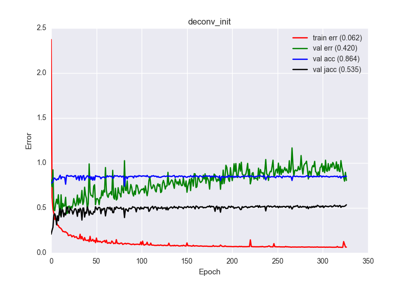

# Deep learning for polyp characterization

## Results
| Id | Model | Parameters                         | Train set        | Val set          | Test set                       |Tr. Loss|Val. Loss|Val. Acc|Val. Jacc|Test Acc|Test Jacc|Epochs |
| --- | --- | --- | --- | --- | --- | --- | --- | --- | --- | --- | --- | --- |
| 1 | FCN8 | Rep+Conv, lr=1e-4, l2=1e-3           | CVC-612          | CVC-300          | CVC-300                         | 0.52   | 0.41    | 86.99% | 54.89%  | 86.99% | 54.89%  | 139|
| 2 | FCN8 | Rep+Conv, lr=1e-4, l2=1e-3, He(Relu) | CVC-612          | CVC-300          | CVC-300                         | 0.42   | 0.45    | 86.93% | 53.95%  | 86.93% | 53.95%  | 183|
| 3 |FCN8 | Deconv_init, lr=1e-3, l2=1e-5         | CVC-612          | CVC-300          | CVC-300                         | 0.16   | 0.66    | 81.37% | 52.50%  | 81.37% | 52.50%  | 157|
| 4 | FCN8 | Rep+Conv, lr=1e-4, l2=1e-3, He(Relu) | CVC-612 (20 seq) | CVC-612  (5 seq) | CVC-612  (5 seq)                | 0.48   | 0.38    | 89.03% | 62.25%  | 89.61% | 63.04%  | 222|
| 5 | FCN8 | Deconv_init, lr=1e-4, l2=1e-5, He(Relu), voids | CVC-612 (20 seq) | CVC-612  (5 seq) | CVC-612  (5 seq)      | 0.64   | 0.66    | 85.27% | 54.84%  | 85.19% | 52.58%  | 212|
| 6 | U-Net | ???                                 | CVC-612          | CVC-612          | CVC-612                         | 0.65   | 94.37%  | 	0.66% | ??.??%  | ??.??% | ??.??%  | ?? |

### Experiment 5 (Deconv_init, lr=1e-4, l2=1e-5, He(Relu), voids)
Note that here the performance is worse because we don't count the void class that was very easy to detect

## Posible problems to solve
 1. Polyp/No polyp image classification
 2. Polyp/Lumen/Specularity detection 
 3. Image semantic segmentation for the classes: Polyp/Lumen/Specularity/Void/Background
 4. Instance segmentation (Tracking of Polyps/Lumen/Specularities)
 5. Video Segmentacion
 6. Domain Adaptation
 7. Polyp classification (There are several types of polyps)
 
## Experiment configurations
 1. Intra pacient evaluation
 2. Inter pacient evaluation
 3. Inter camera evaluation
 4. Inter polyp evaluation
 
## First paper contributions
 1. Generate a public dataset that allows to perform different experiments
 2. Test a set of baselines for this dataset
  1, Jorge's published methods
  2. Deep learning methods: FCN8 y UNET
 
## Dataset
 1. Two datasets with: 300 and 612 color and fully annotated frames
 2. CVC-300 dataset is acquired at Irland and CVC-612 at Spain. The cameras are different.
 2. Image semantic annotation for each frame with the classes: Void(0)/Background(1)/Polyp(2)/Specularity(3)/Lumen(4)
 3. For each frame this extra metadata:
   1. Frame ID (In the dataset)
   2. Frame ID (In the original video) This data still is not available
   3. Patiend ID
   4. Polyp ID

## Framework
Keras

## Members
 1. Jorge Bernal
 2. Adriana Romero
 3. Michal Drozdzal
 4. David Vázquez
 5. People from Clinic? Jorge's Supervisor?
 7. Yoshua Bengio? Aaron Courville? Adriana's students?

## TODO
 - [X] Get Jorge's dataset with labels
 - [X] Adapt the dataset to work with FCN8 in lasagne
 - [X] First experiments with FCN8 in Lasagne
 - [X] Init weights with Glorot for Relu or He 
 - [X] Take voids into account
 - [X] Check for bugs in the plots code 
 - [ ] Solve issues with the CSV of CVC-612
 - [ ] Define a good split of the data for training/validation/test using the CSV files with the frames metadata
 - [ ] Upload FCN8 code for Keras
 - [ ] Normalize images using mean and std??
 - [ ] Weight the class contributions to be able of learning specularities (Very small) 
 - [ ] Add DICE evaluation
 - [ ] Experiments with FCN8 in Lasagne to get reasonable results
 - [ ] Add data augmentation
 - [ ] First experiments with Unet in Lasagne
 - [ ] Adapt the dataset to work in Keras
 - [ ] Move Unet model to Keras
 - [ ] Define experiments
 - [ ] Get Jorge's baselines for the proposed experiments
 - [ ] Select journal target (Michail has a proposal of a top medical imaging journal that answer in 1 month)
 - [ ] Add Frame ID (In the original video) to the datasets csv
 - [ ] Perform experiments
 - [ ] Write paper

## References jorge
 - [Impact of Image Preprocessing Methods on Polyp Localization in Colonoscopy Frames. Jorge Bernal et al.] (https://www.researchgate.net/profile/Jorge_Bernal5/publication/257602625_Impact_of_image_preprocessing_methods_on_polyp_localization_in_colonoscopy_frames/links/558924a208aed6bff80b3aa6.pdf) 
 - [WM-DOVA Maps for Accurate Polyp Highlighting in Colonoscopy: Validation vs. Saliency Maps from Physicians. Jorge Bernal et al.](http://158.109.8.37/files/BSF2015.pdf)
 - [Polyp Segmentation Method in Colonoscopy Videos by means of MSA-DOVA Energy Maps Calculation. Jorge Bernal et al.](http://158.109.8.37/files/BNS2014.pdf)

## References deep learning
 - [Fully Convolutional Networks for Semantic Segmentation. Jonathan Long et al.](https://arxiv.org/pdf/1411.4038.pdf)
 - [U-Net: Convolutional Networks for Biomedical Image Segmentation. Olaf Ronneberger et al.](https://arxiv.org/pdf/1505.04597.pdf)
